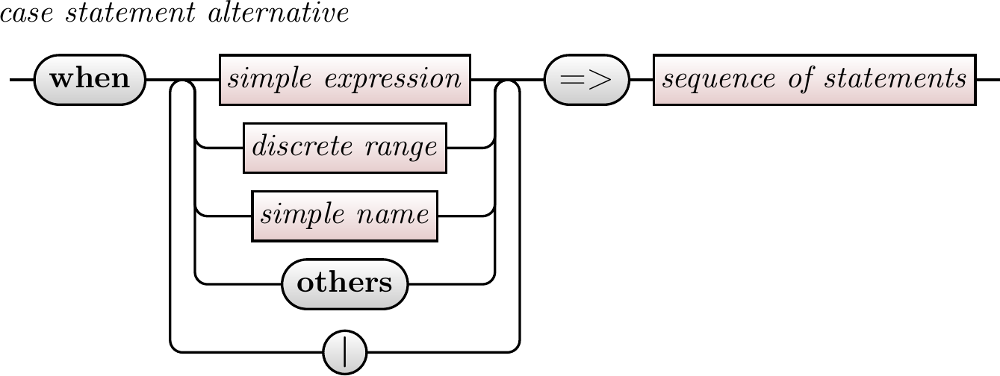

# ebnf2tikz

An optimizing compiler to convert (possibly annotated) <a href=https://en.wikipedia.org/wiki/Extended_Backus%E2%80%93Naur_form>Extended Backus–Naur  Form</a> (EBNF) to railroad diagrams expressed as LaTeX <a href=https://en.wikipedia.org/wiki/PGF/TikZ> TikZ</a> commands.

For example, if  you feed a file containing the following annotated EBNF into ebnf2tikz:
```ebnf
case_statement_alternative =
    'when' , choices , '=>', sequence_of_statements;

subsume
choices =
    choice, { '|', choice } ;

subsume
choice =
    simple_expression |
    discrete_range |
    simple_name |
    'others' ;
```
Then it will output the following TikZ code:

```latex
\begin{figure}
\centerline{
\begin{tikzpicture}
\node at (0pt,0pt)[anchor=west](name){\railname{case\_statement\_alternative\strut}};
\coordinate (node42) at (59.3677pt,-21pt);
\coordinate (node42linetop) at (59.3677pt,-27pt);
\coordinate (node42linebottom) at (59.3677pt,-101pt);
\draw [rounded corners=\railcorners] (node42linetop) -- (node42linebottom);
\draw [rounded corners=\railcorners] (node42linetop) -- (node42) -- +(east:8pt);
\coordinate (node45) at (67.3677pt,-21pt);
\coordinate (node45linetop) at (67.3677pt,-27pt);
\coordinate (node45linebottom) at (67.3677pt,-79pt);
\draw [rounded corners=\railcorners] (node45linetop) -- (node45linebottom);
\draw [rounded corners=\railcorners] (node45linetop) -- (node45) -- +(west:8pt);
\coordinate (node51) at (156.118pt,-21pt);
\coordinate (node51linetop) at (156.118pt,-27pt);
\coordinate (node51linebottom) at (156.118pt,-79pt);
\draw [rounded corners=\railcorners] (node51linetop) -- (node51linebottom);
\draw [rounded corners=\railcorners] (node51linetop) -- (node51) -- +(east:8pt);
\coordinate (node53) at (164.118pt,-21pt);
\coordinate (node53linetop) at (164.118pt,-27pt);
\coordinate (node53linebottom) at (164.118pt,-101pt);
\draw [rounded corners=\railcorners] (node53linetop) -- (node53linebottom);
\draw [rounded corners=\railcorners] (node53linetop) -- (node53) -- +(west:8pt);
\node (node1) at (16pt,-21pt)[anchor=west,terminal] {\railtermname{when\strut}};
\writenodesize{node1}
\draw [rounded corners=\railcorners] (node1.east) -- (node42.west);
\node (node47) at (75.3677pt,-21pt)[anchor=west,nonterminal] {\railname{simple\_expression\strut}};
\writenodesize{node47}
\node (node48) at (83.5977pt,-43pt)[anchor=west,nonterminal] {\railname{discrete\_range\strut}};
\writenodesize{node48}
\node (node49) at (84.5176pt,-65pt)[anchor=west,nonterminal] {\railname{simple\_name\strut}};
\writenodesize{node49}
\node (node50) at (92.8288pt,-87pt)[anchor=west,terminal] {\railtermname{others\strut}};
\writenodesize{node50}
\draw [rounded corners=\railcorners] (node45.east) -- (node47.west);
\draw [rounded corners=\railcorners] (node47.east) -- (node51.west);
\node (node52) at (104.743pt,-109pt)[anchor=west,terminal] {\railtermname{|}};
\writenodesize{node52}
\draw [rounded corners=\railcorners] (node42.east) -- (node45.west);
\draw [rounded corners=\railcorners] (node51.east) -- (node53.west);
\node (node4) at (172.118pt,-21pt)[anchor=west,terminal] {\railtermname{=>\strut}};
\writenodesize{node4}
\draw [rounded corners=\railcorners] (node53.east) -- (node4.west);
\node (node5) at (199.775pt,-21pt)[anchor=west,nonterminal] {\railname{sequence\_of\_statements\strut}};
\writenodesize{node5}
\draw [rounded corners=\railcorners] (node4.east) -- (node5.west);
\draw [rounded corners=\railcorners] (node48.west) -- (node48.west-|node45) -- (node45linetop);
\draw [rounded corners=\railcorners] (node49.west) -- (node49.west-|node45) -- (node45linetop);
\draw [rounded corners=\railcorners] (node50.west) -- (node50.west-|node45) -- (node45linetop);
\draw [rounded corners=\railcorners] (node52.west) -- (node52.west-|node42) -- (node42linetop);
\draw [rounded corners=\railcorners] (node48.east) -- (node48.east-|node51) -- (node51linetop);
\draw [rounded corners=\railcorners] (node49.east) -- (node49.east-|node51) -- (node51linetop);
\draw [rounded corners=\railcorners] (node50.east) -- (node50.east-|node51) -- (node51linetop);
\draw [rounded corners=\railcorners] (node52.east) -- (node52.east-|node53) -- (node53linetop);
\end{tikzpicture}
}
\caption{No Caption.}
\label{No Caption.}
\end{figure}
```

You will need a ```latex \usepackage{ebnf2tikz}``` command in the preamble of your LaTeX document.
You can just include that code in your LaTeX document, and it will draw this:




This is a work in progress.  There are still a couple of bugs that I am aware of, but nothing major.
I have not really started working on newlines, so the diagrams can easily become wider than the space available.  

