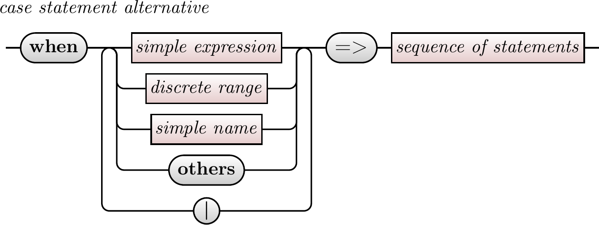

# ebnf2tikz

Author: Larry D. Pyeatt

An optimizing compiler that converts (possibly annotated) [Extended Backus-Naur Form](https://en.wikipedia.org/wiki/Extended_Backus%E2%80%93Naur_form) (EBNF) grammar specifications into railroad (syntax) diagrams expressed as LaTeX [TikZ](https://en.wikipedia.org/wiki/PGF/TikZ) commands.

## Example

Given the following annotated EBNF input:

```ebnf
case_statement_alternative =
    'when' , choices , '=>', sequence_of_statements;

<<-- subsume -->>
choices =
    choice, { '|', choice } ;

<<-- subsume -->>
choice =
    simple_expression |
    discrete_range |
    simple_name |
    'others' ;
```

ebnf2tikz produces TikZ code that renders this railroad diagram:



The `subsume` annotation causes `choices` and `choice` to be inlined directly into `case_statement_alternative`, and the optimizer simplifies the resulting AST into the compact diagram shown above.

## Prerequisites

- C++ compiler with C++17 support (e.g., g++)
- [Bison](https://www.gnu.org/software/bison/) >= 3.7
- [Flex](https://github.com/westes/flex)
- [CMake](https://cmake.org/) >= 3.16
- pdflatex with TikZ (for generating diagrams)
- [Doxygen](https://www.doxygen.nl/) (optional, for building API documentation)

## Building

```bash
cmake .
make              # Build binary, extract .sty, build package docs, run check-tikz
make check        # Run all 167 AST-dump regression tests
make check-tikz   # Build PDF with all railroad diagrams (requires pdflatex)
make check-sty    # Run LaTeX package integration tests
make sty          # Extract ebnf2tikz.sty from .dtx
make sty-doc      # Build ebnf2tikz.pdf package documentation
make doc          # Generate Doxygen API documentation
make realclean    # Remove all build artifacts
```

Build products placed in the project root: `ebnf2tikz` (binary), `ebnf2tikz.sty` (LaTeX package), `ebnf2tikz.pdf` (package documentation).

## Usage

```
./ebnf2tikz [options] input_file output_file
```

### Options

| Option | Description |
|--------|-------------|
| `-O`, `--optimize` | Enable optimization (default; accepted for compatibility) |
| `-n`, `--nooptimize` | Disable optimization and subsumption |
| `-f`, `--makefigures` | Wrap tikzpictures in LaTeX figure environments |
| `-d`, `--dumponly` | Parse and dump the AST; do not generate TikZ output |
| `-B`, `--dump-before` | Dump the AST before optimization (to stdout) |
| `-A`, `--dump-after` | Dump the AST after optimization (to stdout) |
| `-h`, `--help` | Print usage information |

### Multi-Pass Workflow

ebnf2tikz requires a feedback loop with LaTeX because accurate layout depends on knowing the rendered dimensions of each node.  LaTeX measures these dimensions and writes them to `bnfnodes.dat` via the `\writenodesize` command.  The typical workflow is:

1. Run `ebnf2tikz` to produce initial TikZ output (with estimated node sizes).
2. Run `pdflatex` to render the diagrams and generate `bnfnodes.dat`.
3. Run `ebnf2tikz` again to produce accurate TikZ output (using real node sizes).
4. Run `pdflatex` again for the final PDF.

This is similar to the multi-pass workflow needed by BibTeX or makeindex.

### LaTeX Setup

The `ebnf2tikz` LaTeX package (`ebnf2tikz.sty`) provides all required TikZ styles, commands, and the multi-pass infrastructure.  Add to your preamble:

```latex
\usepackage{ebnf2tikz}
```

The package provides `\ebnffile{file.ebnf}` to register EBNF source files, an `ebnf` environment for inline grammars, and `\useproduction{name}` to place individual diagrams.  With `-shell-escape`, the package runs ebnf2tikz automatically.  Package options: `figures` (wrap diagrams in figure environments), `nooptimize` (disable optimization).

See the package documentation (`ebnf2tikz.pdf`) for full details.

### EBNF Input Format

ebnf2tikz accepts standard EBNF with these constructs:

| Syntax | Meaning |
|--------|---------|
| `A = expr ;` | Production rule |
| `A , B` | Sequence (concatenation) |
| `A \| B` | Choice (alternation) |
| `[ expr ]` | Optional |
| `{ expr }` | Repetition (loop) |
| `( expr )` | Grouping |
| `'text'` or `"text"` | Terminal |
| `? text ?` | Special sequence (rendered as terminal) |
| `\\\\` | Explicit line break |

Comments are supported in three forms: `// line comment`, `--- line comment`, and `(* block comment *)`.

### Annotations

Annotations are placed before a production definition using `<<-- ... -->>` syntax:

```ebnf
<<-- subsume -->>
production_name = expr ;

<<-- subsume as regex_pattern -->>
production_name = expr ;

<<-- caption description -->>
production_name = expr ;

<<-- sideways -->>
production_name = expr ;
```

| Annotation | Effect |
|------------|--------|
| `subsume` | Inline this production's body wherever its name is referenced |
| `subsume as <regex>` | Inline into nonterminals matching the POSIX extended regex |
| `caption <string>` | Set the LaTeX figure caption |
| `sideways` | Use a `sidewaysfigure` environment |

### Auto-Wrap

Productions whose body exceeds the available `\textwidth` are automatically broken across multiple rows.  Wide nonterminal labels containing spaces are also wrapped using `\shortstack` to reduce their width.

## Testing

```bash
make check          # Run all 167 AST-dump regression tests
make check-tikz     # Build PDF with all railroad diagrams (requires pdflatex)
make check-sty      # Run LaTeX package integration tests
```

Tests live in `unit_tests/`.  Each test is a `.ebnf` file with a matching `expected/<name>.expected` file containing the expected AST dump output.  Tests that require specific flags have a `flags/<name>.flags` file; the default is `-n -d` (unoptimized dump).

To add a new test:

1. Create `unit_tests/<N>_<name>.ebnf`
2. Optionally create `unit_tests/flags/<N>_<name>.flags` (e.g., `-d` for optimized dump)
3. Run `./ebnf2tikz [flags] <file>.ebnf /dev/null` and save stdout to `unit_tests/expected/<N>_<name>.expected`

Production names must be unique across all `.ebnf` files because `make check-tikz` concatenates them into a single input.

## API Documentation

```bash
make doc            # Generate HTML and PDF documentation in documentation/
```

This produces:

- `documentation/ebnf2tikz.pdf` -- complete API reference
- `documentation/index.html` -- entry point for the HTML documentation

Requires Doxygen and pdflatex.

## Architecture

The compiler follows a classic pipeline:

```
lexer.ll -> parser.yy -> AST -> resolver::subsume -> ast_optimizer::optimize
  -> auto-wrap -> dump mode: astDumpGrammar (stdout)
                -> TikZ mode: ast_layout -> ast_tikzwriter (output file)
```

### Key Source Files

Source files live in the `src/` directory.

| File | Purpose |
|------|---------|
| `ast.hh/cc` | AST node hierarchy (Terminal, Nonterminal, Epsilon, Sequence, Choice, Optional, Loop, Newline) |
| `ast_optimizer.hh/cc` | Fixed-point optimization passes (merge, lift, loop analysis) |
| `ast_layout.hh/cc` | Layout engine: sizing, coordinate placement, connection routing |
| `ast_tikzwriter.hh/cc` | TikZ code emission from layout results |
| `resolver.hh/cc` | Reference checking and subsumption |
| `ast_dump.hh/cc` | AST dump for regression testing |
| `driver.hh/cc` | Parser driver coordinating Flex/Bison |
| `nodesizes.hh/cc` | Node dimension cache (reads `bnfnodes.dat`) |
| `diagnostics.hh/cc` | Structured error/warning reporting |
| `parser.yy` / `lexer.ll` | Main Bison/Flex grammar and tokenizer |
| `annot_parser.yy` / `annot_lexer.ll` | Annotation sub-parser and tokenizer |
| `main.cc` | CLI entry point |
| `util.hh/cc` | Utility functions |

## License

This program is free software: you can redistribute it and/or modify it under the terms of the GNU General Public License as published by the Free Software Foundation, either version 3 of the License, or (at your option) any later version.

See [LICENSE](LICENSE) for the full text.
