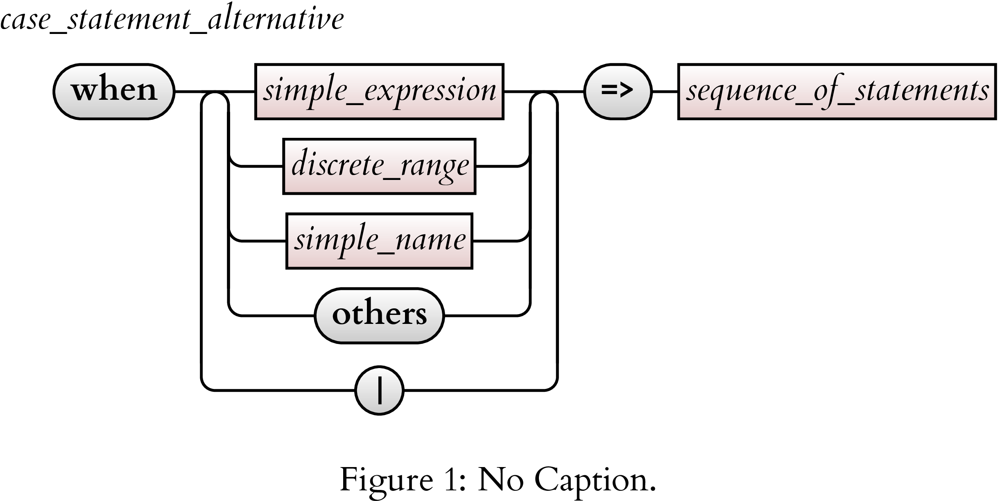

# ebnf2tikz

An optimizing compiler to convert (possibly annotated) <a href=https://en.wikipedia.org/wiki/Extended_Backus%E2%80%93Naur_form>Extended Backus–Naur  Form</a> (EBNF) to railroad diagrams expressed as LaTeX <a href=https://en.wikipedia.org/wiki/PGF/TikZ> TikZ</a> commands.

In other words, you feed this file into ebnf2tikz:
```
case_statement_alternative =
    'when' , choices , '=>', sequence_of_statements;

subsume
choices =
    choice, { '|', choice } ;

subsume
choice =
    simple_expression |
    discrete_range |
    simple_name |
    'others' ;
```
and it outputs the TikZ code to create this:



You can then just include the TikZ code in your LaTeX document, and have beautiful rail diagrams.

This is a work in progress.  There are still a couple of bugs, and I have not started working on newlines, so the diagrams can easily become wider than the space available.  
